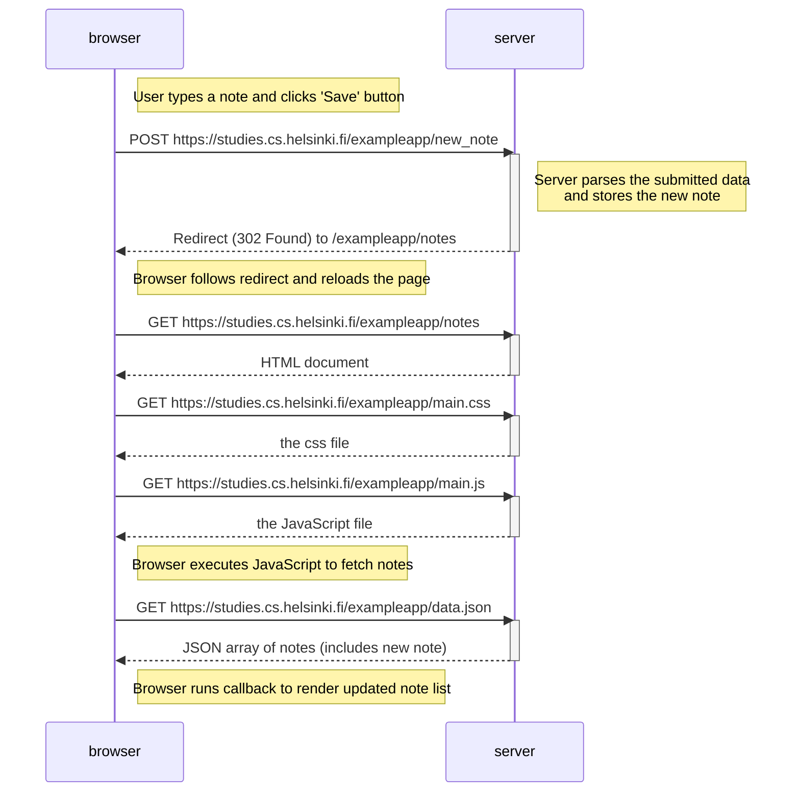
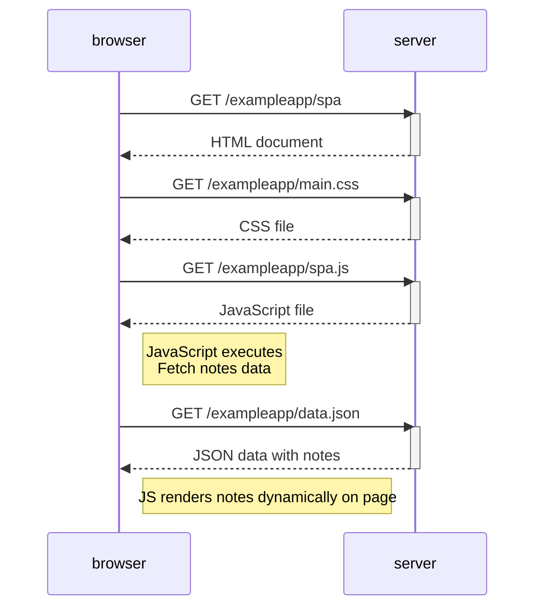
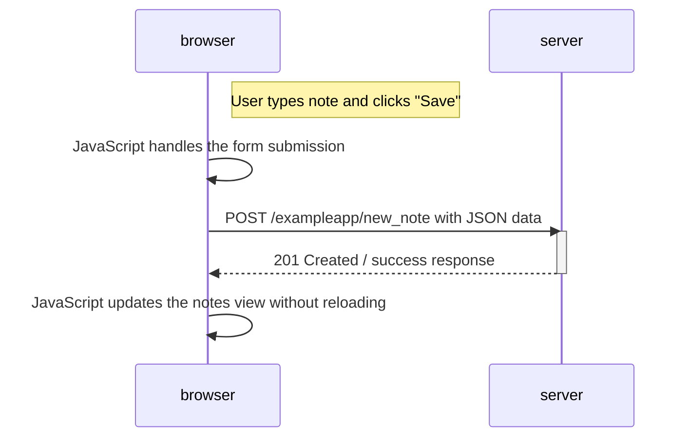

# Fullstack
## Part 0:
### 0.1: read already
### 0.2: read already
### 0.3: read already
### 0.4: 

```mermaid
sequenceDiagram
    participant browser
    participant server

    Note right of browser: User types a note and clicks 'Save' button

    browser->>server: POST https://studies.cs.helsinki.fi/exampleapp/new_note
    activate server
    Note right of server: Server parses the submitted data<br/>and stores the new note
    server-->>browser: Redirect (302 Found) to /exampleapp/notes
    deactivate server

    Note right of browser: Browser follows redirect and reloads the page

    browser->>server: GET https://studies.cs.helsinki.fi/exampleapp/notes
    activate server
    server-->>browser: HTML document
    deactivate server

    browser->>server: GET https://studies.cs.helsinki.fi/exampleapp/main.css
    activate server
    server-->>browser: the css file
    deactivate server

    browser->>server: GET https://studies.cs.helsinki.fi/exampleapp/main.js
    activate server
    server-->>browser: the JavaScript file
    deactivate server

    Note right of browser: Browser executes JavaScript to fetch notes

    browser->>server: GET https://studies.cs.helsinki.fi/exampleapp/data.json
    activate server
    server-->>browser: JSON array of notes (includes new note)
    deactivate server

    Note right of browser: Browser runs callback to render updated note list
```

### 0.5:

```mermaid
sequenceDiagram
    participant browser
    participant server

    browser->>server: GET /exampleapp/spa
    activate server
    server-->>browser: HTML document
    deactivate server

    browser->>server: GET /exampleapp/main.css
    activate server
    server-->>browser: CSS file
    deactivate server

    browser->>server: GET /exampleapp/spa.js
    activate server
    server-->>browser: JavaScript file
    deactivate server

    Note right of browser: JavaScript executes<br/>Fetch notes data

    browser->>server: GET /exampleapp/data.json
    activate server
    server-->>browser: JSON data with notes
    deactivate server

    Note right of browser: JS renders notes dynamically on page
```

### 0.6:

```mermaid
sequenceDiagram
    participant browser
    participant server

    Note right of browser: User types note and clicks "Save"

    browser->>browser: JavaScript handles the form submission

    browser->>server: POST /exampleapp/new_note with JSON data
    activate server
    server-->>browser: 201 Created / success response
    deactivate server

    browser->>browser: JavaScript updates the notes view without reloading
```